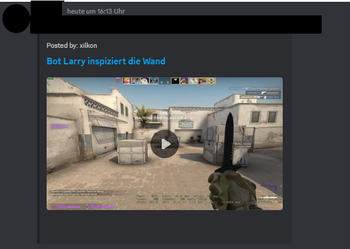
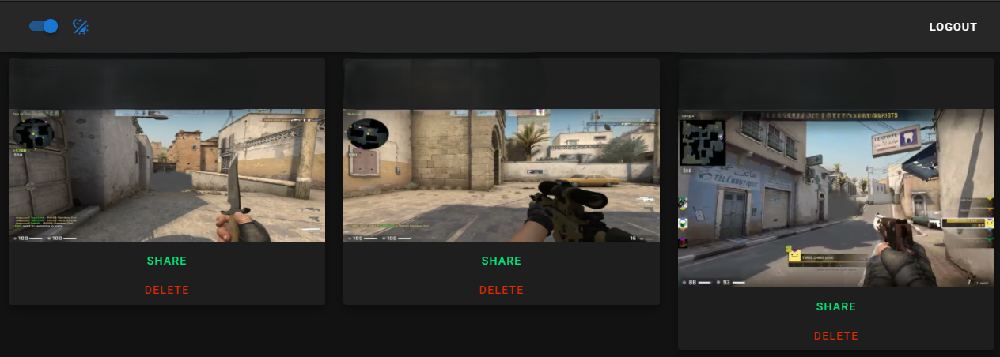
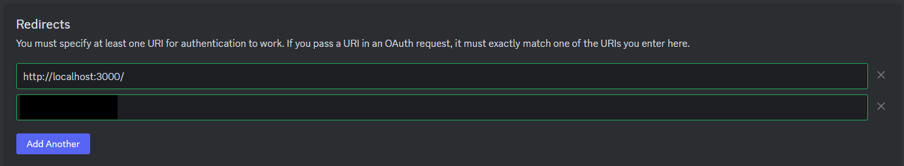

# Clipupload-Discord

The Clipupload-Discord project was designed to share clips with your friends on a Discord Server.

Clips are looking like this in Discord and direct playback works as well:


Webapplication when logged in with clips can look like this:


The features / requirements for this application were:
- Frontend
    - oauth login via Discord
    - Upload clips via drag-and-drop
    - Delete clips which you dont want to share anymore
    - Easy copy url function to share with friends
- Backend
    - Support all needed endpoints
    - Support mp4 files and create a folder structure like this:
        - `${clipsFolderPath}/${Discord-UserID}/${VideoID}(.mp4 | .avif)`
    - Create thumbnails for the videos which were uploaded (small footprint)
    - Post a video as soon it has been uploaded to a user defined Discord Channel
    - Only a specific group on the Discord Server is allowed to upload clips / log into the website

## How to use

Requirements to use this software are these:
- Experience with server configuration and Docker
- Server Hardware (small VPS with enough storage should be sufficient)
    - Docker (Docker Compose for the whole orchestration)
- Domain (e.g. my-upload-service.com)
- Setup discord application

### Production

The production system could look like this:

docker-compose.yml:
```
---
services:
  swag:
    image: lscr.io/linuxserver/swag:latest
    container_name: swag
    cap_add:
      - NET_ADMIN
    environment:
      - PUID=1000
      - PGID=1000
      - TZ=Etc/UTC
      - URL=my-upload-service.com
      - VALIDATION=http
    volumes:
      - ${folderPathOnVPS}/webserver:/config
      - ${folderPathOnVPS}/clips/:/mnt/clips/files:ro
    ports:
      - 443:443
      - 80:80
    depends_on:
      - backend
      - frontend
    restart: unless-stopped

  backend:
    image: ghcr.io/benediktbertsch/clip-backend:latest
    container_name: clip-backend
    environment:
      - App__Frontend=https://my-upload-service.com
      - Discord__EndPoint=https://discord.com/api
      - Discord__ScopeBot=identify guilds
      - Discord__IdBot=YOUR_BOT_ID
      - Discord__SecretBot=YOUR_BOT_SECRET
      - Discord__TokenBot=YOUR_BOT_TOKEN
      - Discord__GuildId=YOUR_GUILD_ID
      - Discord__RoleId=YOUR_ROLE_ID_THAT_IS_ELIGIBLE_TO_UPLOAD_CLIPS
      - Discord__ChannelId=YOUR_CHANNEL_ID_THAT_BOT_WILL_POST_TO
      - Files__Path=/mnt/clips
    volumes:
      - ${folderPathOnVPS}/clips:/mnt/clips
      - ${folderPathOnVPS}/videos.db:/app/videos.db
    ports:
      - 8080:8080
      - 8081:8081
    restart: unless-stopped

  frontend:
    image: ghcr.io/benediktbertsch/clip-frontend:latest
    container_name: clip-frontend
    environment:
     - NUXT_PUBLIC_API_URL="https://my-upload-service.com/api"
     - NUXT_PUBLIC_BASE_URL="https://my-upload-service.com"
     - NUXT_PUBLIC_DISCORD_URL="YOUR_BOT_OAUTH_ROUTE_URL"
    ports:
      - 3000:3000
    restart: unless-stopped
```

The NGINX configuration (`${folderPathOnVPS}/webserver/nginx/site-confs/default.conf`) could look then like this:
```
# REDIRECT HTTP TRAFFIC TO https://my-upload-service.com
server {
        listen 80;
        server_name my-upload-service.com;
        return 301 https://$server_name$request_uri;
}

server {
        listen 443 ssl http2;
        server_name my-upload-service.com;

        location / {
                proxy_pass http://clip-frontend:3000;
        }

        location /files/ {
                root /mnt/clips/;
        }

        location /api {
                rewrite ^/api/(.*)$ /$1 break;
                client_max_body_size 3G;
                proxy_read_timeout 1800;
                proxy_connect_timeout 1800;
                proxy_send_timeout 1800;
                send_timeout 1800;
                proxy_pass http://clip-backend:8080;
        }
}
```

Your frontend should be then available via `https://my-upload-service.com`, the backend via `https://my-upload-service.com/api` and all your static files (videos and thumbnails) then via `https://my-upload-service.com/files/`

### Development

The local development environment needs the same variables as the production environment.

You can set it up by editing the for the backend the `appsettings.json` and all its variables to the correct ones.

The frontend needs to be configured with the `nuxt.config.ts` file. The content should look like this:
```
runtimeConfig: {
    public: {
      baseUrl: "http://localhost:3000/",
      apiUrl: "https://localhost:7044/",
      discordUrl: "OBTAINED_VIA_BOT_OAUTH_ROUTE"
    },
  },
```

Important is to set the oauth url to http://localhost:3000/ in the discord development dashboard like this with the correct scope (identify + guilds):



The generated URL should then look like this: `https://discord.com/oauth2/authorize?client_id=XXREDACTEDXX&response_type=code&redirect_uri=http%3A%2F%2Flocalhost%3A3000%2F&scope=identify+guilds`

## History

The history looks like this:
- The backend and frontend were updated to the latest versions of their frameworks
    - backend .Net Core 5 changed to .Net Core 8
    - backend only handles local files (removed google drive implementation)
    - frontend NuxtJs 2.13 changed to latest stable 3.12
    - frontend changed video player to vidstack
    - complete rewrite of most of the code for better readability
- The backend has been reworked to .Net Core 5 and to use google drive as storage
- Initial release as a complete vue (nuxtjs v.2.13) + nodejs based project